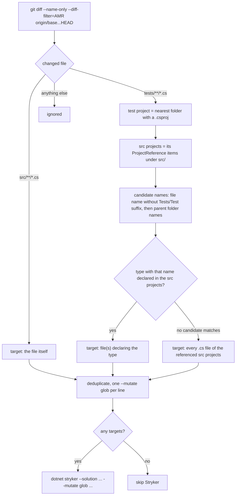

# Demo .NET Mutation Tests with Stryker

Demo of mutation testing with [Stryker.NET](https://stryker-mutator.io/docs/stryker-net/introduction/) on a multi-project .NET 10 solution, with two GitHub Actions workflows:

- **Pull requests**: mutation tests only for the code changed in the PR (fast feedback).
- **Weekly**: mutation tests for the whole solution (complete picture).

Both workflows are prepared to publish the results to SonarCloud.

This README also documents **why the PR workflow does not use Stryker's built-in `--since` option**, what went wrong with it, and other pitfalls found while setting this up, so the same approach can be reused in other projects.

## Table of contents

- [Solution structure](#solution-structure)
- [Running mutation tests locally](#running-mutation-tests-locally)
- [CI workflows](#ci-workflows)
- [Decision: --mutate instead of --since](#decision---mutate-instead-of---since)
- [Why --since did not work](#why---since-did-not-work)
- [--since vs --mutate](#--since-vs---mutate)
- [How mutation targets are detected](#how-mutation-targets-are-detected)
- [Tool install/restore problem](#tool-installrestore-problem)
- [Other Stryker.NET gotchas](#other-strykernet-gotchas)
- [Checklist: applying this to another project](#checklist-applying-this-to-another-project)
- [Troubleshooting](#troubleshooting)
- [References](#references)


## Solution structure

| Project | Path | Tested by |
|---|---|---|
| Domain | `src/Demo.Domain` | `tests/Demo.Domain.Tests` (unit tests) |
| Application | `src/Demo.Application` | `tests/Demo.Application.Tests` (unit tests with NSubstitute) |
| Infrastructure | `src/Demo.Infrastructure` | no dedicated test project, only indirectly by `tests/Demo.Api.Tests` |
| Api | `src/Demo.Api` | `tests/Demo.Api.Tests` (integration tests: `WebApplicationFactory` + Testcontainers MySQL) |

- The solution file is [demo-dotnet-mutation-tests-stryker.slnx](demo-dotnet-mutation-tests-stryker.slnx) and the SDK is pinned in [global.json](global.json).
- The tests use **xUnit v2 + VSTest** (see [Other Stryker.NET gotchas](#other-strykernet-gotchas) for why).
- `Demo.Api.Tests` starts a MySQL container through Testcontainers, so **Docker must be running**, locally and in CI (`ubuntu-latest` runners have Docker).
- Stryker is a local .NET tool pinned in [.config/dotnet-tools.json](.config/dotnet-tools.json).


## Running mutation tests locally

Prerequisites: the .NET SDK from [global.json](global.json) and Docker.

Full solution, same as the weekly workflow, with [mutation-tests.bat](mutation-tests.bat):

```bat
dotnet tool restore
dotnet restore demo-dotnet-mutation-tests-stryker.slnx
dotnet build demo-dotnet-mutation-tests-stryker.slnx --no-restore
dotnet stryker --solution demo-dotnet-mutation-tests-stryker.slnx --reporter json --reporter cleartext --reporter html -O StrykerOutput/
```

The HTML report is written to `StrykerOutput/reports/mutation-report.html`.

Only the changed code, same as the PR workflow (Git Bash, Linux or macOS):

```bash
bash .github/scripts/detect-mutation-targets.sh origin/main /tmp/mutate-files.txt

mutate_args=()
while IFS= read -r glob; do mutate_args+=(--mutate "$glob"); done < /tmp/mutate-files.txt

# Never call Stryker with an empty list: no --mutate means "mutate everything"
if [ ${#mutate_args[@]} -gt 0 ]; then
  dotnet stryker --solution demo-dotnet-mutation-tests-stryker.slnx "${mutate_args[@]}"
fi
```


## CI workflows

| | PR workflow | Weekly workflow |
|---|---|---|
| File | [sonarcloud-and-mutations-pr.yml](.github/workflows/sonarcloud-and-mutations-pr.yml) | [sonarcloud-and-mutations-weekly.yml](.github/workflows/sonarcloud-and-mutations-weekly.yml) |
| Trigger | `pull_request` to `main` (opened, reopened, edited, synchronize) | `schedule: '0 20 * * 0'` (Sunday 20:00 **UTC**) and `workflow_dispatch` |
| Mutated code | files changed in the PR + files under test by changed tests | the whole solution |
| Stryker command | `dotnet stryker --solution <slnx> --mutate <glob> ...` | `dotnet stryker --solution <slnx>` |
| Concurrency | one run per PR, older runs are cancelled | n/a |

PR workflow, main steps:

1. Checkout with `fetch-depth: 0` and fetch the PR base branch (needed for `git diff`).
2. **Detect mutation targets** with [.github/scripts/detect-mutation-targets.sh](.github/scripts/detect-mutation-targets.sh). The list, with the reason for each target, is written to the job summary and the step sets the output `has_changes`.
3. **Run Stryker** with one `--mutate` per target, only when `has_changes == 'true'`.
4. Convert the report for SonarCloud and publish the Stryker markdown report to the job summary.
5. When there is nothing to mutate, Stryker is skipped and the summary says so.

### SonarCloud integration

- Stryker's `mutation-report.json` is converted by [tests/mutation-report-to-sonar.jq](tests/mutation-report-to-sonar.jq) into SonarQube's [generic external issues format](https://docs.sonarsource.com/sonarqube-cloud/analyzing-source-code/importing-external-issues/generic-issue-data/) (rules `MutantSurvived` and `MutantNoCoverage`) and passed with `sonar.externalIssuesReportPaths`.
- Code coverage comes from `dotnet-coverage collect "dotnet test ..." -f xml` (`sonar.cs.vscoveragexml.reportsPaths`) and test results from `.trx` files (`sonar.vstest.reportsPaths`).
- The PR workflow adds `sonar.pullrequest.*` for PR decoration, and only passes the mutation report when Stryker actually ran.
- **Currently the "Build and analyze" (SonarCloud) and "Add Stryker Report in PR Comment" steps are commented out.** Uncomment them and configure the secrets below to enable them.

| Secret / variable | Used for |
|---|---|
| `SONAR_TOKEN` (secret) | SonarCloud authentication |
| `SONAR_PROJECT_KEY` (secret) | SonarCloud project key |
| `SONAR_ORGANIZATION` (workflow `env`) | SonarCloud organization |
| `STRYKER_API_KEY` (secret) | only if the Stryker Dashboard reporter (`--reporter dashboard --dashboard-api-key`) is re-enabled for the badge in the PR comment |


## Decision: --mutate instead of --since

### Context

The goal of the PR workflow is to speed up mutation testing by only testing new or modified code. Stryker.NET has an option for exactly that, [`--since:<committish>`](https://stryker-mutator.io/docs/stryker-net/configuration/#since-flag-committish), so the first version of the workflow used:

```bash
dotnet stryker --solution demo-dotnet-mutation-tests-stryker.slnx --since:origin/main ...
```

On PR #3 (4 source files and 3 test files changed) it still mutated the whole solution, including files that were not touched, and took 10m51s.

### Decision

The PR workflow computes the mutation targets itself from

```bash
git diff --name-only --diff-filter=AMR origin/<base>...HEAD
```

in [.github/scripts/detect-mutation-targets.sh](.github/scripts/detect-mutation-targets.sh), and passes each target to Stryker as [`--mutate "<glob>"`](https://stryker-mutator.io/docs/stryker-net/configuration/#mutate-glob). `--since` is not used.

### Why

- In `--solution` mode `--since` classifies **every changed file as a test file**, so it can't tell source changes from test changes ([Problem 1](#problem-1-solution-mode-classifies-every-file-as-a-test-file)).
- `--since` diffs against the **working directory, including untracked files**, so anything a CI step writes into the checkout counts as a change ([Problem 2](#problem-2-the-diff-includes-untracked-files-in-the-workspace)).
- Even when it works as designed, a changed test re-tests **every mutant that test covers**, and an integration test covers most of the application ([Problem 3](#problem-3-by-design-a-changed-test-re-tests-everything-it-covers)).
- With `--mutate` the behaviour is deterministic: we decide exactly which files are mutated and the list is visible in the job summary.

### Consequences

- (+) Only relevant mutants are tested. PR #3 measured locally: 38 mutants tested and 42 "Removed by mutate filter", against 68 tested with `--since`.
- (+) A changed test still triggers mutation tests for the code it tests.
- (-) The test to source mapping relies on naming conventions, with a safe fallback (the whole project) when it can't find a match.
- (-) The granularity is per file: adding 7 lines to `ProductsEndpoints.cs` mutates the whole file. Stryker supports spans (`File.cs{10..100}`), so line-level targeting is a possible future improvement.
- (-) Stryker still builds the solution and runs the initial test run of every test project (including Testcontainers), a fixed overhead of about 3.5 minutes in CI.
- (-) An empty target list must never reach Stryker, because no `--mutate` means "mutate everything". The workflow skips Stryker in that case.
- The PR report only contains the targeted files. The full picture comes from the weekly workflow.


## Why --since did not work

Based on Stryker.NET 5.0.0 source code (links in [References](#references)).

### How --since works internally

1. `GitDiffProvider.ScanDiff()` compares the tree of the target commit with the **working directory** (LibGit2Sharp `Diff.Compare<Patch>(commit.Tree, DiffTargets.WorkingDirectory)`).
2. Each changed file goes to `ChangedTestFiles` if its path starts with one of the test project paths, otherwise to `ChangedSourceFiles`. The test project paths are `options.TestProjects` (`-tp`) and, **when that list is empty, `options.ProjectPath`**.
3. `SinceMutantFilter` then decides, for each source file:
   - if any "changed test file" is **not** a `.cs` file: **all mutants are tested** (`Non-CSharp files in test project were changed`);
   - else, if the file is in `ChangedSourceFiles`: all mutants of that file are tested;
   - else its mutants are ignored, **but** if any changed test file is a `.cs` file, every mutant covered by a test living in a changed test file (or by a test whose source file is unknown) is tested again (`One or more covering tests changed`).

### Problem 1: solution mode classifies every file as a test file

With `--solution` and no `-tp`, `TestProjects` is empty and `ProjectPath` is the directory Stryker was started from, which is the repository root. Every changed file starts with that path, so **every changed file, including `src/**/*.cs`, becomes a "changed test file"** and `ChangedSourceFiles` is always empty. From the PR #3 job log:

```text
Changed test file /home/runner/work/demo-dotnet-mutation-tests-stryker/demo-dotnet-mutation-tests-stryker/src/Demo.Api/ProductsEndpoints.cs
Changed test file /home/runner/work/demo-dotnet-mutation-tests-stryker/demo-dotnet-mutation-tests-stryker/src/Demo.Domain/Product.cs
```

[`since.ignore-changes-in`](https://stryker-mutator.io/docs/stryker-net/configuration/#sinceignore-changes-in-string) can't fix this: it only removes files from the lists, it doesn't change how they are classified.

### Problem 2: the diff includes untracked files in the workspace

Because the diff is against the working directory, untracked (and not git-ignored) files are changes too. The workflow installs `dotnet-sonarscanner` and `dotnet-coverage` into `./.sonar/scanner` **before** running Stryker (see [Tool install/restore problem](#tool-installrestore-problem)). That added 125 "changed" files, most of them not `.cs`, which combined with Problem 1 triggered the "non-C# test file changed, test everything" rule:

```text
132 files changed
Changed test file .../.sonar/scanner/.store/dotnet-coverage/18.11.2/dotnet-coverage/18.11.2/tools/net8.0/any/Microsoft.CodeCoverage.Core.dll
Changed test file .../.sonar/scanner/.store/dotnet-sonarscanner/11.3.0/dotnet-sonarscanner/11.3.0/dotnet-sonarscanner.nuspec
...
68    mutants will be tested because: Non-CSharp files in test project were changed
```

### Problem 3: by design, a changed test re-tests everything it covers

Even with Problems 1 and 2 fixed, the rule "a changed test re-tests every mutant it covers" is too broad here. PR #3 changed `ProductTest.cs` and added an integration test. An integration test through `WebApplicationFactory` executes `Program`, the DI setup, the endpoints and the repository, so most of the solution would be re-tested anyway. What we want is: a changed test mutates the **code under test**.

### Evidence from PR #3

- Changed in the PR: `src/Demo.Api/ProductsEndpoints.cs`, `src/Demo.Application/Setup.cs`, `src/Demo.Application/UseCases/GetLowStockProductsUseCase.cs`, `src/Demo.Domain/Product.cs` and 3 test files.
- Mutated anyway, although unchanged: `Program.cs`, `ProductsRepository.cs`, Infrastructure `Setup.cs`, `AddProductUseCase.cs`, `DeleteProductCommand.cs`, `GetProductsQuery.cs`, `UpdateProductCommand.cs`.
- Timings: analysis + build + initial test runs about 2m20s, coverage capture about 1m15s, mutant runs about 7m20s, 10m51s in total.


## --since vs --mutate

| | `--since:<committish>` | own `git diff` + `--mutate "<glob>"` (chosen) |
|---|---|---|
| Who decides what changed | Stryker (LibGit2Sharp) | the workflow (`git diff`) |
| Compared against | target commit vs **working directory** (includes untracked, non-ignored files) | target commit vs `HEAD` (commits only) |
| `--solution` mode | broken: every file is a "test file" | works: the glob is matched against the full and the relative path |
| Changed source file | all mutants of that file | all mutants of that file |
| Changed test file | all mutants covered by that test (from coverage data) | all mutants of the file declaring the type under test (found by name) |
| Changed non-`.cs` file in a test project | all mutants of the project | ignored |
| Granularity | file | file (spans like `File.cs{10..100}` are possible) |
| Report | only changed mutants get a result | only targeted files get a result |
| Main pitfall | silently tests everything | an empty target list mutates everything, so it must be guarded |
| Configuration | CLI `--since`, config `since.target`, `since.ignore-changes-in` | CLI `-m` / `--mutate` (repeatable), config `mutate` |

Neither gives a full report on a PR. Stryker's [`--with-baseline`](https://stryker-mutator.io/docs/stryker-net/configuration/#with-baseline-flag-committish) merges the partial run with a stored baseline, but it implies `--since` and inherits the same diff problems.


## How mutation targets are detected



Rules implemented by [.github/scripts/detect-mutation-targets.sh](.github/scripts/detect-mutation-targets.sh):

- Only added, modified and renamed files are considered (`--diff-filter=AMR`). Deleted files have nothing left to mutate.
- `src/**/*.cs`: the file itself becomes the target `**/<path>`.
- `tests/**/*.cs`:
  1. The test project is the nearest parent folder containing a `.csproj`.
  2. The source projects are the `<ProjectReference>` items of that `.csproj` that point into `src/`.
  3. Candidate type names, in order: the file name without the `Tests` or `Test` suffix, then the parent folder names from the nearest to the farthest.
  4. The first candidate declared as `class`, `record`, `struct` or `interface` in those source projects wins, and the file(s) declaring it become the targets.
  5. If no candidate matches, every `.cs` file of the referenced source projects is targeted (`**/src/<Project>/**/*.cs`). Slower, but a test change never goes untested.
- Everything else is ignored: `.github/`, docs, `.csproj` files (e.g. Dependabot bumps), SQL seed data, etc.

Examples, all verified against this repository:

| Changed file | Mutation target | Why |
|---|---|---|
| `src/Demo.Infrastructure/ProductsRepository.cs` | `**/src/Demo.Infrastructure/ProductsRepository.cs` | source file |
| `tests/Demo.Domain.Tests/ProductTest.cs` | `**/src/Demo.Domain/Product.cs` | type `Product` |
| `tests/Demo.Application.Tests/UseCases/UpdateProductUseCaseTests.cs` | `**/src/Demo.Application/UseCases/UpdateProductCommand.cs` | type `UpdateProductUseCase` is declared in `UpdateProductCommand.cs` |
| `tests/Demo.Application.Tests/UseCases/GetProductUseCaseTests.cs` | `**/src/Demo.Application/UseCases/GetProductsQuery.cs` | record `GetProductUseCase` |
| `tests/Demo.Api.Tests/ProductsEndpoints/GetProductTests.cs` | `**/src/Demo.Api/ProductsEndpoints.cs` | no type `GetProduct`, parent folder `ProductsEndpoints` matches |
| `tests/Demo.Api.Tests/IntegrationTestsFactory.cs` | `**/src/Demo.Api/**/*.cs` | no match, whole project |
| `tests/Demo.Api.Tests/Api.Tests.csproj` | none | not a `.cs` file |

Output for PR #3, as shown in the job summary:

```text
- `**/src/Demo.Api/ProductsEndpoints.cs` (changed `src/Demo.Api/ProductsEndpoints.cs`; test `tests/Demo.Api.Tests/ProductsEndpoints/GetLowStockProductsTests.cs` -> type `ProductsEndpoints`)
- `**/src/Demo.Application/Setup.cs` (changed `src/Demo.Application/Setup.cs`)
- `**/src/Demo.Application/UseCases/GetLowStockProductsUseCase.cs` (changed `...`; test `tests/Demo.Application.Tests/UseCases/GetLowStockProductsUseCaseTests.cs` -> type `GetLowStockProductsUseCase`)
- `**/src/Demo.Domain/Product.cs` (changed `src/Demo.Domain/Product.cs`; test `tests/Demo.Domain.Tests/ProductTest.cs` -> type `Product`)
```

Limitations:

- Tests must follow `<Type>Tests.cs`, `<Type>Test.cs`, or live in a folder named after the type. Otherwise the fallback mutates the whole project.
- Only source projects **directly** referenced by the test project are searched. `Demo.Api.Tests` only references `Demo.Api`, so a change in an integration test never targets Application or Infrastructure. Those are mutated when their own files change, and by the weekly workflow.
- The script expects the `src/` and `tests/` layout. Adjust the `case` at the bottom of the script for other layouts.


## Tool install/restore problem

What both workflows do:

```yaml
- name: "Restore .NET Tools"
  run: dotnet tool restore   # dotnet-stryker, from .config/dotnet-tools.json

- name: "Cache SonarCloud scanner"
  uses: actions/cache@...
  with:
    path: ./.sonar/scanner

- name: "Install SonarCloud scanner"
  if: steps.cache-sonar-scanner.outputs.cache-hit != 'true'
  run: |
    mkdir -p ./.sonar/scanner
    dotnet tool update dotnet-sonarscanner --tool-path ./.sonar/scanner
    dotnet tool update dotnet-coverage --tool-path ./.sonar/scanner
```

### The problem

`--tool-path ./.sonar/scanner` installs the tools (or restores them from the cache) **inside the repository checkout**, and `.sonar/` is not in `.gitignore`. For git they are untracked files, and any tool that inspects the working tree sees them. Stryker's `--since` counted 125 of them (`.dll`, `.json`, `.nuspec`, `.png`, ...) as changes, and together with [Problem 1](#problem-1-solution-mode-classifies-every-file-as-a-test-file) they became "non-C# test files" that forced a full run.

The same would happen with any artifact generated inside the workspace before Stryker runs (reports, coverage files, `.trx`, ...).

`dotnet tool restore` itself was not a problem: local tools from the manifest are restored into the NuGet global packages folder (`~/.nuget/packages`), outside the repository.

### Potential fixes

Needed only if `--since` or `--with-baseline` is used again:

1. **Local tool manifest**: add `dotnet-sonarscanner` and `dotnet-coverage` to [.config/dotnet-tools.json](.config/dotnet-tools.json) (`dotnet tool install <tool>` in the repo root, without `--global`) and run them with `dotnet tool run <command>`. One `dotnet tool restore` for all tools, pinned versions that Dependabot can update, no extra cache/install steps and nothing written into the workspace.
2. **Install outside the workspace**: `--tool-path "${{ runner.temp }}/sonar-scanner"`, and cache that path instead.
3. **Ignore the folder**: add `.sonar/` to `.gitignore`. LibGit2Sharp doesn't report ignored files. Cheapest fix, but every new generated folder has to be remembered.
4. **Order the steps**: run Stryker before any step that writes into the workspace.

General rule: keep everything CI generates outside the checkout or git-ignored.

### Why it is not a problem with the current approach

- [detect-mutation-targets.sh](.github/scripts/detect-mutation-targets.sh) uses `git diff origin/<base>...HEAD`, which compares two commits and never looks at the working tree.
- Stryker without `--since` or `--with-baseline` doesn't read git at all.

So the scanner in `./.sonar/scanner` is harmless and the workflows were left as they are. **If `--since` or `--with-baseline` is reintroduced, apply one of the fixes above first.**


## Other Stryker.NET gotchas

Found while setting up this repository with Stryker.NET 5.0.0.

1. **Test runner and xUnit version.** The working setup here is xUnit v2 (`xunit` 2.9.3, `xunit.runner.visualstudio` 2.8.2, `Microsoft.NET.Test.Sdk`) with Stryker's default VSTest runner and `--solution`.
   - **xUnit v3** (`xunit.v3`) runs on Microsoft Testing Platform (MTP). With the default VSTest runner Stryker reports "is using Microsoft.Testing.Platform which is not yet supported" and finds 0 tests. It needs [`--test-runner mtp`](https://stryker-mutator.io/docs/stryker-net/configuration/#test-runner-string), which is still in preview.
   - MTP combined with `--solution` **hung indefinitely** during the per-test coverage capture. Per-project runs (`-tp <Tests.csproj> -p <Project.csproj> --test-runner mtp`) worked.
   - MTP per-test coverage was **flaky** ("Test run timed out while capturing per-test coverage", "Timed out waiting for coverage relay ack"). The fix was `"coverage-analysis": "all"` in `stryker-config.json`. [`coverage-analysis`](https://stryker-mutator.io/docs/stryker-net/configuration/#coverage-analysis-string) has **no CLI flag**, only the config file.
   - **`xunit.v3.mtp-off`** (xUnit v3 forced onto VSTest) with the VSTest runner gave a **0% mutation score**: every mutant "survived", with no error at all. Always check that the score is plausible after changing test packages.
2. **`--solution` must run from the folder that contains the solution file.** From another folder it fails with "No .csproj or .fsproj file found".
3. **`-o` is `--open-report`.** The output folder is `-O` / `--output` (capital O).
4. **Benign warnings.** These don't affect the results:
   - "Project X simulated build failed. Trying again with a nuget restore." and "Analysis of project X succeeded but simulated build failed; Stryker may fail later." come from Buildalyzer's dry-run build; the real build afterwards succeeds.
   - "Failed to load analyzer 'Microsoft.CodeAnalysis.Razor.Compiler'" with newer SDKs is harmless for projects without Razor.
5. **Moving tests from xUnit v3 to v2.** Replace `TestContext.Current.CancellationToken` with `CancellationToken.None`. `IAsyncLifetime` methods return `Task` instead of `ValueTask`, so a `WebApplicationFactory` fixture needs an explicit `Task IAsyncLifetime.DisposeAsync()`, because `WebApplicationFactory` already has `ValueTask DisposeAsync()`.


## Checklist: applying this to another project

1. Make sure Stryker gives realistic scores on the full solution locally first (see the gotchas above).
2. Copy [.github/scripts/detect-mutation-targets.sh](.github/scripts/detect-mutation-targets.sh) and add `*.sh text eol=lf` to `.gitattributes`. Otherwise Windows checkouts with `core.autocrlf=true` get CRLF line endings and the script fails under Git Bash.
3. If the layout isn't `src/` + `tests/`, adjust the `case` at the bottom of the script.
4. Check the test naming convention (`<Type>Tests.cs`, `<Type>Test.cs`, or a folder named after the type). Run the script on a few branches and review the reasons it prints.
5. In the PR workflow: checkout with `fetch-depth: 0`, fetch the base branch, run the script, and guard every Stryker-related step with `steps.changes.outputs.has_changes == 'true'`.
6. Keep a scheduled full run (weekly) for the complete report.
7. Don't reintroduce `--since` without cleaning the workspace first and checking the `Changed file` / `Changed test file` lines in the Stryker log.


## Troubleshooting

| Symptom | What to check |
|---|---|
| Which files were mutated in a PR? | The job summary ("Mutation targets since `origin/main`") or the log of the "Detect mutation targets" step, with the reason for each target. |
| Is the mutate filter working? | The Stryker log shows `N mutants got status Ignored. Reason: Removed by mutate filter`. |
| Stryker mutated everything | Check that the "Run Stryker" step received `--mutate` arguments. Stryker must never run with an empty target list. |
| A test change mutated a whole project | The test name/folder didn't match any type (fallback). Rename the test, or accept the slower run. |
| Script fails with `$'\r': command not found` | CRLF line endings. With `.gitattributes` in place, delete the script and run `git checkout -- .github/scripts/detect-mutation-targets.sh`. |
| Trying `--since` again | Look for `N files changed`, `Changed file` vs `Changed test file`, and `mutants will be tested because: ...` in the Stryker log. |


## References

Stryker.NET documentation:

- [Configuration](https://stryker-mutator.io/docs/stryker-net/configuration/): [`mutate`](https://stryker-mutator.io/docs/stryker-net/configuration/#mutate-glob), [`since`](https://stryker-mutator.io/docs/stryker-net/configuration/#since-flag-committish), [`with-baseline`](https://stryker-mutator.io/docs/stryker-net/configuration/#with-baseline-flag-committish), [`coverage-analysis`](https://stryker-mutator.io/docs/stryker-net/configuration/#coverage-analysis-string), [`test-runner`](https://stryker-mutator.io/docs/stryker-net/configuration/#test-runner-string)

Stryker.NET source code referenced above:

- [GitDiffProvider.cs](https://github.com/stryker-mutator/stryker-net/blob/master/src/Stryker.Core/Stryker.Core/DiffProviders/GitDiffProvider.cs): diff against the working directory and test/source classification
- [SinceMutantFilter.cs](https://github.com/stryker-mutator/stryker-net/blob/master/src/Stryker.Core/Stryker.Core/MutantFilters/SinceMutantFilter.cs): which mutants `--since` tests
- [FilePatternMutantFilter.cs](https://github.com/stryker-mutator/stryker-net/blob/master/src/Stryker.Core/Stryker.Core/MutantFilters/FilePatternMutantFilter.cs): `--mutate` matches the full and the relative path
- [MutantFilterFactory.cs](https://github.com/stryker-mutator/stryker-net/blob/master/src/Stryker.Core/Stryker.Core/MutantFilters/MutantFilterFactory.cs): filters are created with the global options (no per-project test paths in solution mode)
- [TestProjectsInput.cs](https://github.com/stryker-mutator/stryker-net/blob/master/src/Stryker.Configuration/Options/Inputs/TestProjectsInput.cs): `-tp` values
- [StrykerOptions.cs](https://github.com/stryker-mutator/stryker-net/blob/master/src/Stryker.Configuration/Options/StrykerOptions.cs): `ProjectPath`, `TestProjects`, `DiffIgnoreChanges`

SonarCloud:

- [Generic issue import format](https://docs.sonarsource.com/sonarqube-cloud/analyzing-source-code/importing-external-issues/generic-issue-data/)
